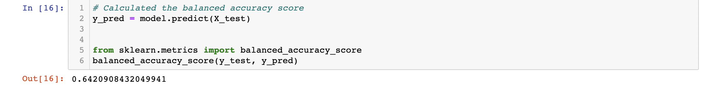
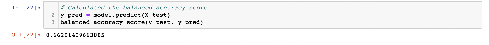
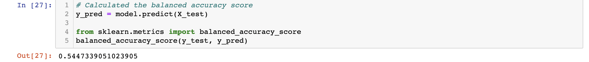
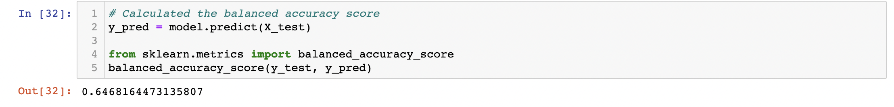

# Credit_Risk_Analysis

## Overview

In this analysis, we used a number of machine learning techniques to try to create a model for predicting credit-worthiness. We compared the accuracy of the different techniques to see which was the most effective. 

## Results

The results of this analysis can be viewed in the .ipynb files contained in this repository. The results of each method are listed below: 

- Naive Random Oversampling

- SMOTE Oversampling

- Undersampling

- SMOTEENN Sampling

- Balanced Random Forest Classifier
The accuracy score using this method could not be determined. 

- Easy Ensemble AdaBoost Classifier
The accuracy score using this method could not be determined. 

## Summary

Using the methods with which we were able to produce reliable accuracy scores, it appears the ___ method is the most accurate at predicting credit worthiness. 
